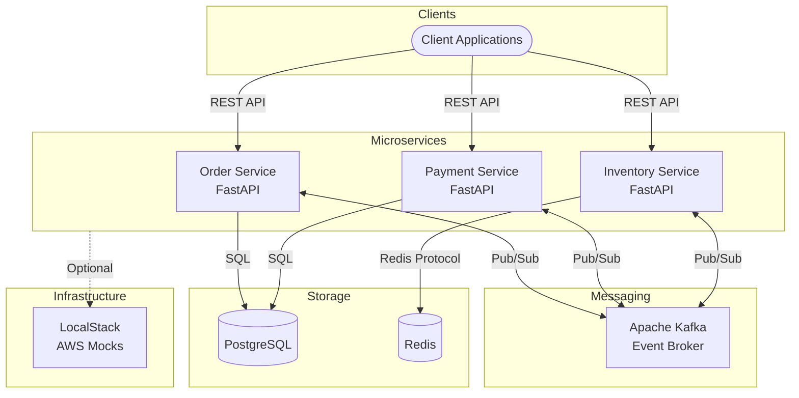
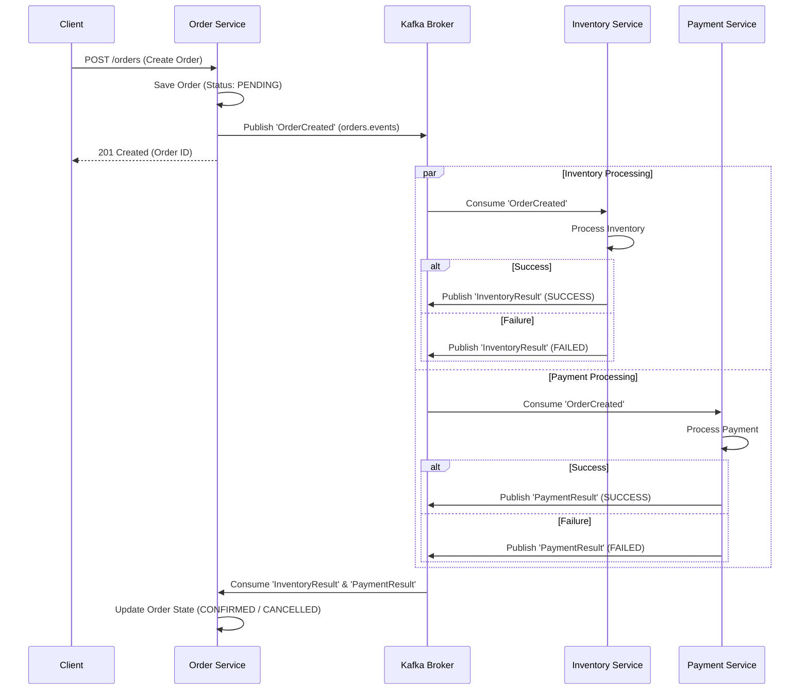

# Cloud Event Processing Platform

Cloud Event Processing Platform is a production-oriented project demonstrating how to design, build, deploy, monitor, and operate a distributed, event-driven backend platform using Python, Apache Kafka, and Kubernetes.

## Architecture

### System Architecture

The platform follows a microservices architecture communicating asynchronously via Apache Kafka.



### Event Flow (Choreography)

When an order is created, the system uses an event-driven choreography pattern to process inventory and payment in parallel.



- **Language:** Python
- **Framework:** FastAPI
- **Messaging:** Apache Kafka
- **Database:** PostgreSQL, Redis
- **Infrastructure:** Docker, Kubernetes, LocalStack
- **Automation:** GitHub Actions, custom `kubeops` CLI

## Structure

- `/services` - Microservices (Order, Payment, Inventory)
- `/kubeops` - Custom CLI for Kubernetes operations
- `/infrastructure` - LocalStack and Terraform configuration
- `/deploy` - Helm charts and Kubernetes manifests
- `/docs` - Project documentation

## Getting Started

*(Documentation to be completed)*

## Local Development Environment

### Prerequisites
- Docker and Docker Compose
- Python 3.12+
- Poetry (or pip)

### Startup Procedure
To build and start the complete local application including infrastructure (PostgreSQL, Redis, Kafka, LocalStack) and all microservices (Order, Payment, Inventory):
```bash
docker compose up --build -d
```
Check if all services and infrastructure containers are healthy:
```bash
docker compose ps
```

### Shutdown/Reset Procedure
To stop the services:
```bash
docker compose stop
```
To completely remove the services and their data (reset state):
```bash
docker compose down -v
```
