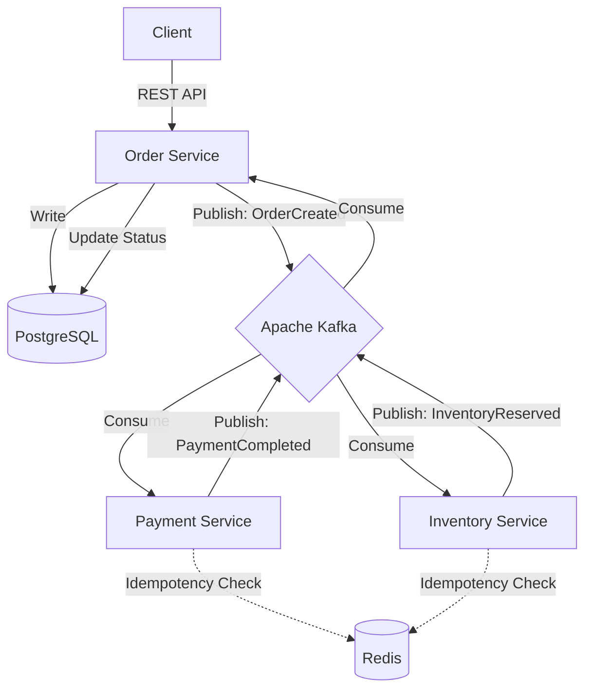

# Cloud Event Processing Platform


A production-oriented platform demonstrating a distributed, event-driven backend built with Python, Apache Kafka, and Kubernetes. The project serves as a showcase for modern Cloud/Backend Engineering practices, including Infrastructure as Code, CI/CD, and custom Kubernetes operations automation.

## Architecture

The system simulates an asynchronous order processing flow across multiple microservices.



### Event Lifecycle
1. **Order Created**: The `Order Service` receives an HTTP request, saves it as `PAYMENT_PENDING`, and publishes an `OrderCreated` event to Kafka.
2. **Parallel Processing**: 
   - `Payment Service` processes the payment and publishes `PaymentCompleted` (or `PaymentFailed`).
   - `Inventory Service` reserves items and publishes `InventoryReserved` (or `InventoryReservationFailed`).
3. **Completion**: The `Order Service` listens for these events, verifies them using Redis for idempotency, and updates the final state in PostgreSQL (`COMPLETED` or `FAILED`).

---

## Local Setup & Docker

The easiest way to run the entire stack locally is via Docker Compose, which spins up all infrastructure dependencies and application services.

```bash
cd cloud-event-platform
docker-compose up --build
```
**Included Infrastructure:**
- `Kafka` (Messaging)
- `PostgreSQL` (Relational DB)
- `Redis` (Idempotency and Caching)
- `LocalStack` (AWS mock)

---

## Kubernetes & Helm Deployment

For a production-like environment, the platform is designed to be deployed to Kubernetes. We provide a custom setup script that utilizes `k3d` for local testing.

### 1. Create Local Cluster
```bash
cd cloud-event-platform/deploy
./setup-cluster.sh
```
*This script will create a k3d cluster, build Docker images, import them to the cluster, and install the Helm chart.*

### 2. Helm Chart
The Helm chart is located at `cloud-event-platform/deploy/helm/cep`. It dynamically provisions Deployments, Services, ConfigMaps, and Secrets for all microservices.

---

## `kubeops` CLI (Kubernetes Automation)

The project includes a custom Python CLI (`kubeops`) that interfaces directly with the Kubernetes API to automate common operational tasks.

### Installation
```bash
poetry install
```

### Usage
- **`kubeops audit -n <namespace>`**: Scans the cluster for configuration issues (missing probes, `latest` image tags, Pods in `CrashLoopBackOff`).
- **`kubeops health -n <namespace>`**: Performs a deep check on application health, readiness, and dependencies.
- **`kubeops deploy -d <deployment> -n <namespace> --auto-rollback`**: Verifies a rollout state. If the deployment fails to become healthy within the timeout, it automatically triggers a rollback.
- **`kubeops rollback -d <deployment> -n <namespace>`**: Safely rolls back a deployment to the previous stable ReplicaSet.

---

## Infrastructure as Code (Terraform & LocalStack)

The project leverages **Terraform** to provision and manage AWS resources declaratively. To avoid cloud costs during local development, Terraform is configured to point directly to a local **LocalStack** container.

### Managed Resources
- **SQS (`cep-dlq-local`)**: Used as a Dead Letter Queue for unprocessable events.
- **S3 (`cep-archive-local`)**: Bucket configured for long-term archiving of reports and database dumps.

### Workflow
```bash
cd cloud-event-platform/infrastructure/terraform
terraform init
terraform plan
terraform apply
```
*Note: Ensure LocalStack is running via `docker-compose` before applying the Terraform configuration.*

---

## Observability

- **Structured Logging**: All Python services output structured JSON/Text logs including `event_id` and `correlation_id` for easy tracing across the distributed system.
- **Metrics**: Services expose Prometheus-compatible endpoints (`/metrics`), tracking HTTP latencies, processed events (`EVENTS_PROCESSED`), and failure rates (`EVENTS_FAILED`).
- **Idempotency**: All consumers use a Redis-backed `IdempotencyManager` (TTL-based) to guarantee exactly-once processing effects.

---

## CI/CD (GitHub Actions)

The platform features a complete CI/CD pipeline (`.github/workflows/deploy.yml`):
1. **Validates code** using Ruff, Mypy, and Pytest.
2. **Builds** the Kubernetes environment using `k3d`.
3. **Deploys** the Helm chart.
4. **Verifies** the deployment utilizing the `kubeops deploy` auto-rollback feature.
5. **Generates** and attaches audit/health reports as Workflow Artifacts.

---

## Known Limitations & Troubleshooting
- **LocalStack**: AWS integrations are routed to LocalStack for local development. In a real environment, the Terraform configuration requires updating the AWS provider to point to real AWS regions and removing the dummy credentials.
- **Kafka Readiness**: In Kubernetes, the Order/Payment services may crashloop initially until Kafka is fully ready. Kubernetes will automatically restart them until the connection succeeds.
